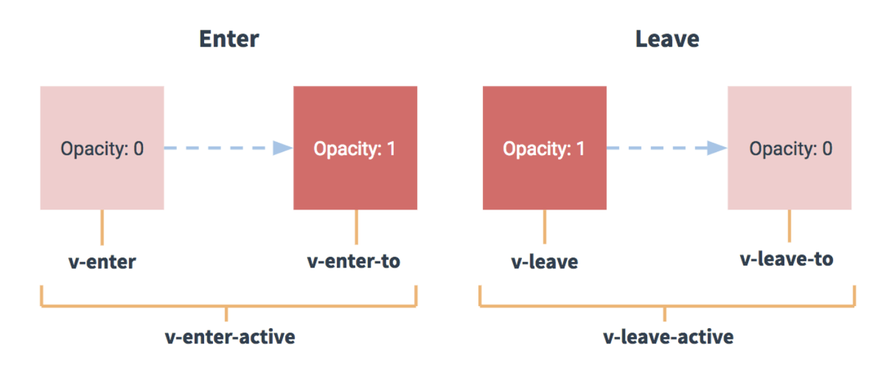

# Vue Transition

style, css에 약한 나에게는 일단 transition 이란 존재조차 모르고 있었는데, 강의에 나와서 배운 내용만이라도 좀 정리하고 가려고 글쓴다.

Transition은 일단 내가 이해하기로는 애니메이션효과(?) 같은 거 같다. 예를 들면 element가 렌더링 될 때 천천~히 스무스하게 나오게 한다거나, 삭제될 때 fade out 되는 것처럼 싹 없어지게 한다거나 할 수 있는 기능같다.

## 이게 Vue의 장점 중의 하나

다른 프레임워크(리액트, 앵귤러겠지?)에서는 멀게만 느껴지는 기능인데 Vue는 공식 가이드 문서에서 쉽게 css class 처럼 쓸 수 있게 가이드 해놔서 그리 멀게만 느껴지지 않게 해뒀다.

## 트랜지션 클래스

1. v-enter: Starting state for enter. element가 삽입 되기 전에 add 되는 class, 1frame 뒤에 없어진다.
2. v-enter-active: Active state for enter. element가 삽입 되는 중에 적용된다. transition / animation이 완료되면 제거된다.
3. v-enter-to: ONLY AVAILABEL IN VERSIONS 2.1.8+, Ending state for enter. element가 삽입되고 1frame 뒤에 적용된다.
4. v-leave: Starting state for leave. element가 leave transition이 trigger 되면 바로 적용되고 1freame 뒤에 없어진다.
5. v-leave-active: enter transition이 트리거 되면 적용되고 transition / animation이 완료되면 제거된다.
6. v-leave-to: ONLY AVAILABEL IN VERSIONS 2.1.8+, v-leave가 제거되고... 어우 뭔말인지 모르겠다

강사님 말씀대로는 enter, leave-to / enter-to, leave 이렇게 쌍으로 많이 쓰인다고 하신다.

여기 예제에서도 list의 enter, leave-to에 opacity, transform 을 주니까 list 안의 지정해둔 태그가 생기거나 없어질 때 투명도가 바뀌고 Y축으로 움직이는 걸 볼 수 있다.(솔직히 나는 이것만 알면 될거같다...)

가이드 내용이랑 매핑시켜보면, 
1. v-enter element가 삽입되기 전에 opacity 0이 적용되고 
2. v-enter-active 상태가 transition/animation 중에 적용 될거니까 이게 0.5초 될거라는 거고
3. v-enter-to가 default가 opacity가 1일거니까 0.5초동안 opacity가 0->1 로 간다.
4. leave-to에 0 해놓고 leave의 dafualt opacity가 1이니까 반대로 1->0

## 결론

실무에서는 뭐 이 정도로 enter/leave 애니메이션 효과(?)를 주는데 쓰이기도 할 것 같다. 나같은 사람도 이렇게 쓸 수 있는 것도 장점이고, 디자이너나 퍼블리셔분들이 Vue에 더 관심을 가질 수 있는 포인트가 될 것 같다.