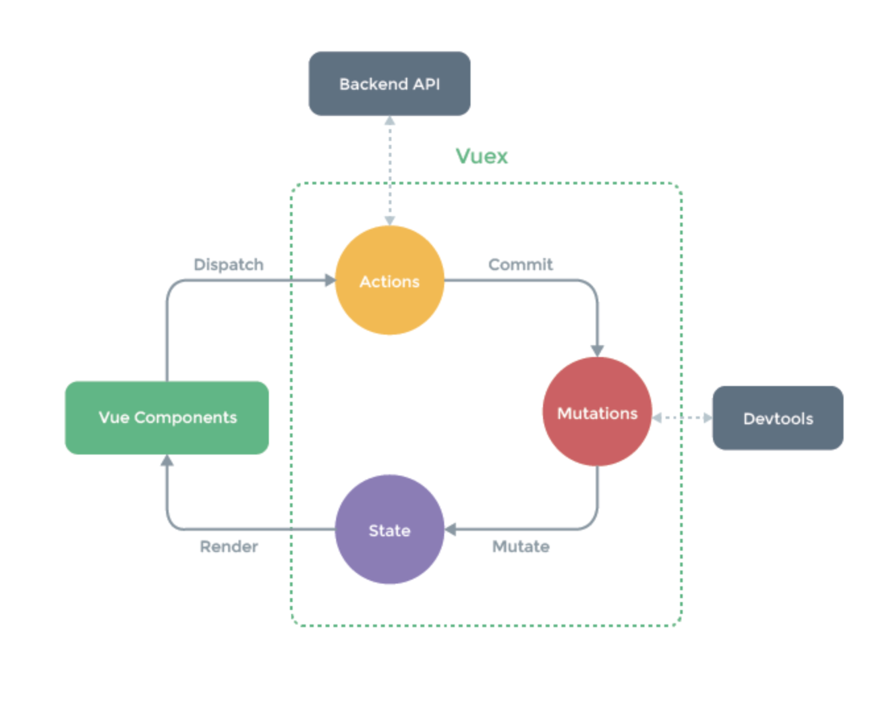

# 중급 강좌에서 나온 Vuex 내용 정리

## FLUX
??

## Vuex가 왜 필요할까?
- 복잡한 애플리케이션에서 컴포넌트의 개수가 많아지면 컴포넌트 간에 데이터 전달이 어려워진다.
- 이거를 이벤트 버스로 해결하려고 하면, 컴포넌트 간 데이터 전달이 명시적이지 않음. 어디서 보냈는지 어디서 받았는지 추적이 안됨.

## Vuex로 해결할 수 있는 문제
- MVC 패턴에서 발생하는 구조적 오류(페이스북 채팅창을 예제로 드셨음)
- 컴포넌트 간 데이터 전달 명시
- 여러 개의 컴포넌트에서 같은 데이터를 업데이트 할 때 동기화 문제

## Vuex 컨셉
- State: 컴포넌트 간에 공유하는 데이터
- View: 데이터를 표시하는 화면
- Action: 사용자의 입력에 따라 데이터를 변경하는 메소드

화면 템플릿에서 버튼을 클릭하면 Action을 발생시키고 그러면 데이터를 변경한다.

## Vuex 구조



## Vuex 설치

```
npm install vuex --save
```

```javascript
import Vue from 'vue'
import Vuex from 'vuex'

Vue.use(Vuex);
```

## Vuex 기술요소

- state: 여러 컴포넌트에 공유되는 데이터
- getters: 연산된 state 값을 접근하는 속성 computed
- mutations: state 값을 변경하는 이벤트 로직, 메소드 methods
- actions: 비동기 처리 로직을 선언하는 메서드 async methods

### 근데 왜 state 바로 안 바꾸고 mutations 거쳐서 해야함?

- 여러개 컴포넌트에서 아래와 같이 state값을 변경하는 경우 어느 컴포넌트에서 해당 state를 변경헀는지 추적하기 어렵다.

```javascript
methods: {
  increaseCounter() { this.$store.state.counter++; }
}
```

- 특정 시점에 어떤 컴포넌트가 state를 접근하여 변경한 건지 확인하기 어렵기 때문
- 따라서, 뷰의 반응성을 거스르지 않게 명시적으로 상태 변화를 수행. 반응성, 디버깅, 테스팅 혜택

### 왜 비동기 처리 로직은 actions에 선언해야 할까?

- 언제 어느 컴포넌트에서 해당 state를 호출하고, 변경했는지 확인하기가 어려움. mutations에서 하면 여러 컴포넌트에서 막 commit 명령어로 같은 mutation을 부른다면 비동기라면 추적하기 어려워진다.


